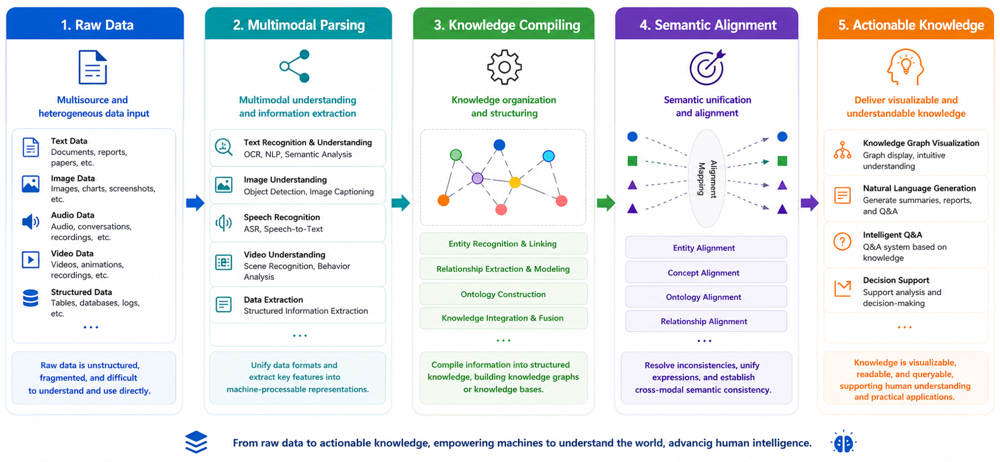

<p align="center">
  
</p>

<p align="center">
  <strong>All-in-One Multimodal Parsing Engine + Ontology-Powered AI-Ready Knowledge Engine</strong><br />
  Parse every modality. Compile knowledge with ontology. Reason before retrieval.
</p>

<p align="center">
  
  
  
  
  
  
</p>

<p align="center">
  <a href="#overview">Overview</a> |
  <a href="#quick-start">Quick Start</a> |
  <a href="#local-development">Local Development</a> |
  <a href="#api-quickstart">API Quickstart</a> |
  <a href="#integration-profile">Integration profile</a> |
  <a href="#document-and-video-parsing">Document and video parsing</a> |
  <a href="#runtime-requirements">Runtime requirements</a> |
  <a href="#community-and-security">Community &amp; Security</a> |
  <a href="#license">License</a>
</p>

---

## Overview

Jonex unifies an all-in-one multimodal parsing engine with an AI-ready knowledge engine. Ontology compiles domain reasoning into the knowledge layer before retrieval begins.

It is an end-to-end enterprise AI knowledge platform that turns raw content into reusable knowledge services. Jonex connects data ingestion, multimodal parsing, domain knowledge compilation, vector and graph indexing, source-grounded retrieval, feedback loops, and business applications in one governed system.

<p align="center">
  
</p>


## Quick Start

Docker Compose is the fastest way to run the complete platform.

### Docker requirements

- Docker Engine or Docker Desktop
- Docker Compose v2 with Buildx
- `make` on macOS or Linux
- Sufficient disk space and time for the first build, which downloads container images, Python dependencies, and RAG models

### 1. Clone the repository

```bash
git clone https://github.com/jonexaiorg/jonex.git
cd jonex
```

### 2. Initialize configuration

```bash
make init
```

This creates:

- `deploy/.env` for the platform, database, object storage, and LLM Gateway
- `deploy/.env.rag` for LightRAG, embeddings, and parsing
- Frontend `.env` files for Shell, Core Business, Ecosystem Management, Platform Management, and Dev Gateway

### 3. Configure model connections

Configure at least one OpenAI-compatible LLM and embedding provider in `deploy/.env`:

```env
LLMGW_UPSTREAM_LLM_HOST=https://your-openai-compatible-host/v1
LLMGW_UPSTREAM_LLM_API_KEY=your_llm_api_key

LLMGW_UPSTREAM_EMBED_HOST=https://your-embedding-host/v1
LLMGW_UPSTREAM_EMBED_API_KEY=your_embedding_api_key
```

If your model names differ from the defaults, also update `LLM_MODEL` and `EMBEDDING_MODEL` in `deploy/.env.rag`.

Keep `LIGHTRAG_API_KEY` identical in `deploy/.env` and `deploy/.env.rag`. For audio, video, or advanced image processing, also configure the VLM and ASR connections in `deploy/.env`.

### 4. Build and start

```bash
make build
make up
make ps
```

The first build creates the shared `jonex/python-base:local` image before Compose builds the platform services in parallel.

Use `make logs` to follow service logs when troubleshooting; press `Ctrl+C` to stop following them without stopping the platform.

### 5. Open Jonex

Visit:

```text
http://localhost/
```

Local demo credentials:

```text
Username: admin
Password: admin123
```

> **Security warning:** These credentials are for local evaluation only. Change or remove the default administrator account before binding Jonex to a non-loopback interface, sharing the deployment, or exposing it to any network. Complete the production checklist in [SECURITY.md](SECURITY.md) before deployment.

### Windows PowerShell

```powershell
.\jonex.ps1 init
.\jonex.ps1 build
.\jonex.ps1 up
.\jonex.ps1 ps
```

Use `.\jonex.ps1 logs` when you need to follow service logs.

If script execution is restricted:

```powershell
powershell -ExecutionPolicy Bypass -File .\jonex.ps1 help
```

### Stop the platform

```bash
make down
```

On Windows:

```powershell
.\jonex.ps1 down
```

## Local Development

Local development uses root-level environment files and VSCode Debug. It is separate from the Docker deployment configuration under `deploy/`.

### Toolchain requirements

- Python `>=3.12.13`
- Node.js `>=20.18.0` (Node.js 22 LTS recommended)
- pnpm `>=9.0.0`
- A current stable version of uv

### Initialize the local environment

```bash
cp .env.local.example .env.local
cp .env.rag.local.example .env.rag.local
mkdir -p .vscode
cp launch.json.example .vscode/launch.json
make frontends-install
```

Set local middleware addresses in `.env.local` to `127.0.0.1`, or replace `SERVER_IP` with a remote infrastructure host. Backend processes are started from VSCode Run and Debug; the Makefile no longer starts host backend processes.

Start the required local dependencies:

```bash
make dev-infra-up  # PostgreSQL, Redis, etcd, MinIO, and Milvus
# Or, when running the complete RAG stack locally:
make dev-deps-up   # Middleware plus LightRAG and Atomic RAG
```

Start the frontend gateway and applications in separate terminals:

```bash
make dev-gateway
make dev-frontend
```

Open `http://localhost:8080`. For complete setup, VSCode debugging, frontend startup, RAG, and troubleshooting instructions, see [Local Full-Stack Debugging](local-fullstack-debugging-guide.md).

## Your First Knowledge Search in Five Minutes

1. Sign in with the local demo credentials `admin / admin123`.
2. Open Core Business and create or select a domain space.
3. Create a knowledge base and organize it with folders or tags.
4. Select a parser profile or preset for the content you plan to ingest.
5. Upload files, or configure a REST API or S3-compatible data source.
6. Wait for multimodal parsing and knowledge compilation to finish.
7. Inspect the parsing results, compiled ontology, relationships, and knowledge graph.
8. Open Knowledge Search, ask a question, verify its references, and submit feedback.

## API Quickstart

All external APIs are exposed through the unified Gateway.

### Sign in

```bash
curl -X POST "http://localhost/api/v1/auth/login" \
  -H "Content-Type: application/json" \
  -d '{"username":"admin","password":"admin123"}'
```

Use the returned `access_token` to call ontology-first search:

```bash
curl -X POST "http://localhost/api/v1/knowledge-base/search/ontology" \
  -H "Authorization: Bearer <access_token>" \
  -H "Content-Type: application/json" \
  -d '{
    "query": "What are the key risks described in these documents?",
    "knowledge_base_ids": ["<knowledge-base-id>"],
    "mode": "hybrid",
    "top_k": 5,
    "with_reasoning": true
  }'
```

The response includes the answer, matched knowledge bases, ontology instances, RAG usage, structured source references, and an optional reasoning trace.


In production, the browser communicates only with Frontend Gateway. Business APIs, capability services, and infrastructure components are not directly exposed to frontend applications.

## Integration profile

- [RAG-Anything](https://github.com/HKUDS/RAG-Anything) and [MinerU](https://github.com/opendatalab/MinerU) can be connected for multimodal content processing and document parsing
- [LightRAG](https://github.com/HKUDS/LightRAG) can be connected through the graph-enhanced retrieval adapter
- [Neo4j](https://neo4j.com/) and [Milvus](https://milvus.io/) are packaged graph and vector persistence integrations
- OpenAI-compatible endpoints provide replaceable LLM, embedding, reranking, VLM, and ASR services

## Document and video parsing

- Deploy the Atomic RAG parser with Docker Compose, run it as an independently scaled capability, or register a compatible parser service through a parser profile
- Process video locally with ASR, keyframes, and vision-language models, or route media analysis to a configured cloud service
- Scale parsing workers independently from the core platform; GPU acceleration is optional for model-heavy workloads

## Runtime requirements

| Deployment profile | Requirements |
|---|---|
| Core platform | Docker Engine or Docker Desktop, Docker Compose v2 with Buildx, PostgreSQL 15, Redis 7, and object storage |
| Vector retrieval | Milvus, etcd, and MinIO or compatible equivalents |
| Ontology graph | A supported graph database service; Neo4j is the packaged integration |
| CPU parsing | Suitable for evaluation and light workloads; capacity scales with file size and concurrency |
| Accelerated parsing | Optional NVIDIA GPU and Container Toolkit for faster OCR, ASR, and vision-language processing; VRAM depends on the selected models |
| Cloud parsing | A compatible parsing or media-analysis endpoint, credentials, object storage, and outbound network access |

## Community and Security

- Read [CONTRIBUTING.md](CONTRIBUTING.md) before opening an issue or pull request.
- Participation is governed by [CODE_OF_CONDUCT.md](CODE_OF_CONDUCT.md).
- Report vulnerabilities privately according to [SECURITY.md](SECURITY.md); do not include vulnerability details in a public issue.
- See [CHANGELOG.md](CHANGELOG.md) for release notes and compatibility changes.

## License

Jonex is licensed under the [Apache License 2.0](LICENSE). Third-party components remain under their respective licenses; see [NOTICE](NOTICE) and [THIRD_PARTY_NOTICES.md](THIRD_PARTY_NOTICES.md).

---

<p align="center">
  <strong>Turn enterprise data into knowledge that is understandable, verifiable, and operational.</strong>
</p>

---

© 2026 JONEX
