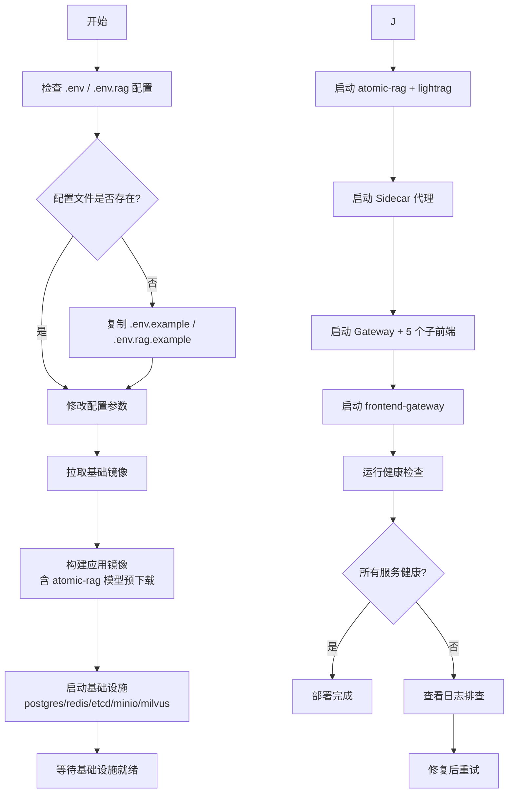

# Jonex平台部署架构设计

> 本文档描述当前 docker-compose 编排下的实际部署形态，与 `deploy/docker-compose.yml` / `deploy/docker-compose.override.yml` / `jonex_core/` 保持同步。

## 一、整体架构设计

### 1.1 流量路径

```
                ┌──────────────────────────────────────────────────────────┐
                │                客户端 / 第三方平台                         │
                └───────────────────────────┬──────────────────────────────┘
                                            │
                ┌───────────────────────────▼──────────────────────────────┐
                │     frontend-gateway (Nginx, 80) — 唯一对外入口           │
                │   静态资源 / SPA 路由回退 / /api 反代 / CSP 安全头   │
                └───┬───────────────────────────────────────────┬──────────┘
                    │ 内部反代到 5 个子前端                       │ /api 反代
                    ▼                                            ▼
   ┌───────────────────────────────────────────────┐    ┌────────────────────┐
   │ 8000)   │
   │ ecosystem-management                          │    │  业务路由聚合       │
   │ (各自独立 Nginx 容器，仅内部 expose:80)        │    │  + 文件落盘        │
   └───────────────────────────────────────────────┘    └─────────┬──────────┘
                                                                  │
                                            ┌─────────────────────▼──────────────────────┐
                                            │     Sidecar 代理 (FastAPI, 容器内 8000)     │
                                            │   认证鉴权 / 调用计量 / 内部 JWT / 反向代理 │
                                            └────┬─────────────┬──────────────┬──────────┘
                                                 │             │              │
                            ┌────────────────────▼─┐  ┌────────▼───────┐  ┌──▼─────────────────┐
                            │  (业务能力，8000)     │  │ (业务能力,8000)│  │  (原子能力, 8000)  │
                            └──────────────────────┘  └────────────────┘  └────────┬───────────┘
                                                                                   │ HTTP X-API-Key
                                                                                   ▼
                                                                          ┌────────────────────┐
                                                                          │  lightrag (9621)   │
                                                                          │  RAG 引擎 + WebUI  │
                                                                          └────────────────────┘

                ┌──────────────────────────────────────────────────────────┐
                │                       基础设施层                          │
                │  PostgreSQL 15 │ Redis 7 │ Milvus 2.5 │ etcd 3.5 │ MinIO  │
                └──────────────────────────────────────────────────────────┘
```

### 1.2 RAG 链路（端到端）

```
浏览器 →[POST 上传文件]→ frontend-gateway →[反代]→ Gateway
   ↓
Gateway 落盘到共享卷 jonex-rag-inputs:/app/inputs，记录元数据
   ↓
Gateway →[/invoke business.knowledge_base.v1]→ Sidecar →[+ 内部 JWT]→ knowledge-base
   ↓
knowledge-base CRUD 状态机 →[/invoke atomic.rag.lightrag.v1 action=insert]→ Sidecar → atomic-rag
   ↓
atomic-rag 异步 worker 解析（mineru/docling/paddleocr）→ ASR（视频/音频走 ffmpeg + whisper）
   ↓
atomic-rag →[POST /documents/text]→ lightrag（生成 track_id）
   ↓
atomic-rag 轮询 GET /documents/track_status/{track_id} 拿 doc_id → 写回任务状态
   ↓
（可选）Stage 4 本体抽取（ONTOLOGY_EXTRACT_ENABLED=true 时执行）
   ├─ 读共享 volume 中 LightRAG 已抽候选实体
   ├─ OntologyExtractor 调 LLM 按 TBox schema 归类/消歧/补属性
   └─ 结果写 Redis task → knowledge-base reconcile 通过 Cypher MERGE 写入 Neo4j（:OntologyEntity / [:ONT_REL]）
   ↓
（可选）atomic-rag → RAG_WEBHOOK_URL 回调 knowledge-base 更新文档状态
```

### 1.3 流式查询链路

```
浏览器 →[GET /api/v1/knowledge-base/documents/search/stream]→ frontend-gateway → Gateway
   ↓
Gateway →[Sidecar /invoke/stream/rag]→ Sidecar
   ↓
Sidecar.stream_rag_query →[GET atomic-rag /query/stream，附 Bearer token]→ atomic-rag
   ↓
atomic-rag.LightRAGAdapter.register_routes 注册的 /query/stream
   ↓
LightRAGServerClient.stream_query →[POST lightrag /query/stream]→ lightrag
   ↓
NDJSON 逐行流回（atomic-rag → Sidecar → Gateway → 浏览器）
```

> 部署模式：
> - 生产模式 (`make up-prod` / `.\jonex.ps1 up-prod`)：仅 frontend-gateway:80 对外，Gateway/Sidecar/能力服务/lightrag 全部收敛在 `jonex-network` 内网。
> - 开发模式 (`make up`)：通过 `docker-compose.override.yml` 把 gateway:8000、sidecar:8001、lightrag:9621、atomic-rag:8004、knowledge-base:8003 同时映射到宿主机便于直连调试与 lightrag WebUI 访问。

## 二、容器设计

### 2.1 frontend-gateway

唯一对外 80 端口入口，基于 Nginx 反代：
- `/api` 路径反代到 Gateway:8000
- CSP / 安全头由本层统一加挂

### 2.2 API Gateway

FastAPI（容器内 8000，dev 映射宿主 8000）：
- 业务路由聚合，CORS、请求追踪、对外 API Key 校验
- 文件上传落盘到 `jonex-rag-inputs:/app/inputs`（与 atomic-rag 共享）
- 业务路由通过 Sidecar `/invoke` 调用能力，流式查询走 Sidecar `/invoke/stream/rag`

### 2.3 Sidecar 代理

FastAPI（容器内 8000，dev 映射宿主 8001）：
- 统一能力调用入口 `/invoke`、流式入口 `/invoke/stream/rag`
- 调用下游能力时使用 `InternalAuth.generate_token("sidecar")` 签发短时（5 min）JWT，附在 `Authorization: Bearer <token>`
- 调用计量 / 限流熔断（接 Redis）

```yaml
resources:
  limits:    { cpus: '2', memory: 2G }
  requests:  { cpus: '0.5', memory: 512M }
```

### 2.4 业务能力容器（knowledge-base）

由 [`deploy/docker/capability.Dockerfile`](docker/capability.Dockerfile) 构建，`CAPABILITY_NAME` 由构建参数指定，启动时由 `deploy/start_capability.py` 完成：

1. 动态导入 `capabilities/<name>/` 包，注册到本地 `CapabilityRegistry`
2. 调用 `capability.initialize()` 完成数据库连接、缓存预热
3. 注册 `ServiceInstance` 到服务发现中心（Redis），启动 30s 周期心跳
4. 暴露 `/invoke`（带 `Depends(verify_internal_service)`） + `/health`

```yaml
# 单实例资源建议
resources:
  limits:   { cpus: '4', memory: 4G }
  requests: { cpus: '1', memory: 1G }
```

### 2.5 atomic-rag（RAG 原子能力容器）

由 [`deploy/docker/atomic-rag.Dockerfile`](docker/atomic-rag.Dockerfile) 构建，特性：

- 系统依赖：libreoffice / ffmpeg / poppler-utils / tesseract-ocr + chi-sim / git
- 直接打包 `Reference/Rag-anything/` 源码到 `/opt/raganything`，`pip install -e ".[all]"` 安装全部 extras
- 构建期 [`download_models.py`](docker/download_models.py) 预下载 whisper base + MinerU2.5-Pro VLM + PaddleX OCR（约 3-4 GB 烤进镜像）
- 启动入口 `start_capability.py`，加载 `LightRAGAdapter`：
  - 注册 `atomic.rag.lightrag.v1` 到 CapabilityRegistry + 服务发现
  - 等待 lightrag `/health` 就绪后初始化（最多 120s）
  - 启动 `RAG_WORKER_NUM`（默认 2）个 ingest worker 异步消费解析任务
  - 注册 `/query/stream` NDJSON 端点
- 视频/音频处理：`_ingest_worker` 检测扩展名后分支到 `parse_video` / `parse_audio` / `parse_document`，视频/音频用 ffmpeg 提 16kHz 单声道 wav，走 whisper 转写后追加 `[视频转写]` / `[音频转写]` 文本块
- GPU 自动检测：`torch.cuda.is_available()` 时把 `device="cuda"` 透传给 mineru；GPU 叠加 `docker-compose.gpu.yml` 分配 NVIDIA 设备
- 本体抽取（可选）：`ONTOLOGY_EXTRACT_ENABLED=true` 时初始化 `OntologyExtractor`，在文档入库后执行 Stage 4 本体抽取，通过 LLM 按 TBox schema 归类/消歧/补属性，结果写入 Redis task → reconcile 用 Cypher MERGE 写入 Neo4j `:OntologyEntity` / `[:ONT_REL]`
- 健康检查 `start_period: 300s`（mineru 首次启动需要解压模型）

```yaml
deploy:
  resources:
    reservations:
      devices: [{driver: nvidia, count: all, capabilities: [gpu]}]
```

### 2.6 lightrag

由 [`deploy/docker/lightrag-source.Dockerfile`](docker/lightrag-source.Dockerfile) 构建（`jonex-lightrag-source`），基于工程内集成的 LightRAG 源码（`Reference/LightRAG`，lightrag-hku 1.4.16）多阶段自建。源码改造（如 `lightrag/llm/ollama.py` 中 `ollama_client.chat()` 注入 `think` 开关关闭 Qwen3.5 思考模式）直接落在源码中，`git diff` 可审查。

- 仅容器内 `expose:9621`，atomic-rag 通过 `LIGHTRAG_API_URL=http://lightrag:9621` 调用，附 `X-API-Key`
- 配置文件 `.env.rag`（70+ 项，70+ 项与平台主 `.env` 分离），支持 JSON/Nano/PG/Milvus/Qdrant/Neo4j/Mongo/Redis/Memgraph/OpenSearch 多种存储后端
- LLM 走 Ollama 原生协议（`LLM_BINDING=ollama`，`BINDING_HOST` 不含 `/v1` 路径），Embedding 仍走 OpenAI 兼容协议
- 通过 `extra_hosts: host.docker.internal:host-gateway` 在 Linux 下访问宿主 Ollama

### 2.7 基础设施容器

| 服务 | 镜像 | 容器内端口 | 数据持久化 | 备注 |
|------|------|-----------|-----------|------|
| Redis | `redis:7-alpine` | 6379 | `jonex-redis-data` | 服务发现注册中心 / 缓存 / 分布式锁；⚠️ 4.0 已 EOL，禁止降级 |
| etcd | `quay.io/coreos/etcd:v3.5.18` | 2379 | `jonex-etcd-data` | Milvus 元数据，硬性要求 ≥3.5.0 |
| MinIO | `minio/minio:RELEASE.2025-04-22T22-12-26Z` | 9000 / 9001 | `jonex-minio-data` | Milvus 对象存储，需 S3 v4 签名 |
| Milvus | `milvusdb/milvus:v2.5.14` | 19530 / 9091 | `jonex-milvus-data` | BM25 + 混合检索（备用，Knowledge Base 当前走 lightrag） |
| Neo4j | `neo4j:5.26-community` | 7687 (bolt) / 7474 (browser) | `jonex-neo4j-data` + `jonex-neo4j-logs` | 本体图数据库（`:OntologyEntity` / `[:ONT_REL]`，APOC 插件）；knowledge-base 通过 `NEO4J_URI` 连接 |

### 2.8 Neo4j 本体图数据库

Neo4j 5.26-community 容器（`deploy/docker-compose.yml`）专用于本体 ABox 存储：

- **镜像**：`neo4j:5.26-community`（APOC 插件已启用，提供 `apoc.coll.toSet`、`apoc.map.merge` 等原子操作）
- **端口**：7687 (Bolt，仅容器内) / 7474 (HTTP Browser，开发期可选暴露)
- **持久化**：`jonex-neo4j-data`（`/data`）+ `jonex-neo4j-logs`（`/logs`）
- **内存**：`NEO4J_HEAP=1G`（可配）、`NEO4J_PAGECACHE=512M`（可配）
- **schema 初始化**：knowledge-base 启动时调用 `ensure_ontology_schema()`，创建复合唯一键约束 `ont_entity_key` + 全文索引 `ont_entity_ft`
- **依赖关系**：knowledge-base + lightrag + atomic-rag 均 `depends_on: neo4j: condition: service_healthy`

### 2.9 本体 schema 配置

`deploy/config/ontology/` 目录存放本体 TBox YAML 定义：

| 文件 | 用途 |
|------|------|
| `default.yaml` | 默认本体 schema（Organization / Person / Product / Concept 等实体类型 + BELONGS_TO / PRODUCES 等关系类型） |

通过 `ONTOLOGY_EXTRACT_ENABLED=true` 启用后，atomic-rag 在文档入库完成后执行 Stage 4 本体抽取。

### 2.9 GPU 加速

`deploy/docker-compose.gpu.yml` 为 atomic-rag 分配 NVIDIA GPU：

```bash
docker compose -f docker-compose.yml -f docker-compose.gpu.yml up -d
```

启用后 `torch.cuda.is_available()` 返回 True，MinerU 和 PyTorch 自动使用 CUDA，atomic-rag CPU 内存从 ~4G 降至 ~2G，显存占用约 6-8G。

## 三、网络设计

### 3.1 网络拓扑

```
┌──────────────────────────────────────────────────────────────────────────────┐
│                       jonex-network (172.28.0.0/16)                          │
│                                                                              │
│  ┌──────────┐ ┌────────┐ ┌──────┐ ┌───────┐ ┌──────────┐ ┌──────────┐        │
│  │postgres  │ │ redis  │ │ etcd │ │ minio │ │  milvus  │ │  neo4j   │  ← 仅内部   │
│  │  5432    │ │ 6379   │ │ 2379 │ │ 9000  │ │  19530   │ │7687/7474 │           │
│  └──────────┘ └────────┘ └──────┘ └───────┘ └──────────┘ └──────────┘        │
│                                                                              │
│  ┌──────────┐ ┌──────────┐ ┌────────────┐ ┌──────────────┐                  │
│  │   8000   │ │   8000   │ │   8000     │ │     8000     │                  │
│  │(开:8000) │ │(开:8001) │ │(开:8002)   │ │(开:8003)     │                  │
│  └──────────┘ └──────────┘ └────────────┘ └──────────────┘                  │
│                                                                              │
│  ┌────────────┐ ┌──────────┐                                                 │
│  │ atomic-rag │ │ lightrag │                                                 │
│  │   8000     │ │   9621   │                                                 │
│  │ (开:8004)  │ │(开:9621) │                                                 │
│  └────────────┘ └──────────┘                                                 │
│                                                                              │
│  ┌──────────────────┐ ┌────────────┐ ┌────────────┐ ┌────────────┐           │
│  │       80         │ │  frontend  │ │  frontend  │ │ business   │           │
│  │   (对外:80)      │ │ (内部:80)  │ │ (内部:80)  │ │ (内部:80)  │           │
│  └──────────────────┘ └────────────┘ └────────────┘ └────────────┘           │
│                                                                              │
│  生产模式 (make up-prod)：仅 frontend-gateway:80 对外                         │
│  开发模式 (make up)：通过 override.yml 额外暴露                               │
│           gateway:8000 / sidecar:8001 / atomic-rag:8004                       │
│           knowledge-base:8003 / lightrag:9621                                 │
└──────────────────────────────────────────────────────────────────────────────┘
```

### 3.2 安全策略

- **数据库 / Redis / etcd / MinIO / Milvus**：仅内部网络访问，不映射宿主端口
- **能力服务 + atomic-rag**：仅 Sidecar 可调用 `/invoke`，校验内部 JWT（`verify_internal_service`）
- **lightrag**：仅 atomic-rag 可调用，使用 `X-API-Key` 鉴权
- **Sidecar / Gateway**：生产模式仅容器内可访问，由 frontend-gateway 反向代理
- **frontend-gateway**：宿主映射 80，作为生产唯一对外入口；CSP / 安全头由本层控制
- **Kubernetes 部署**：可叠加 NetworkPolicy 进一步限制东西向流量

## 四、数据持久化设计

### 4.1 命名卷一览（顶层 `volumes:` 段）

| 卷名 | 用途 | 挂载到 |
|------|------|--------|
| `jonex-postgres-data` | PG 数据 | `postgres:/var/lib/postgresql/data` |
| `jonex-redis-data` | Redis AOF/RDB | `redis:/data` |
| `jonex-etcd-data` | Milvus 元数据 | `etcd:/etcd` |
| `jonex-minio-data` | Milvus 对象存储 | `minio:/minio_data` |
| `jonex-milvus-data` | Milvus 引擎数据 | `milvus:/var/lib/milvus` |
| `jonex-rag-storage` | RAG 解析缓存（atomic-rag/lightrag 共享） | atomic-rag:`/app/rag_storage`<br>lightrag:`/app/data/rag_storage` |
| `jonex-rag-inputs` | 上传文件原件（gateway/atomic-rag/lightrag 共享） | gateway:`/app/inputs`<br>atomic-rag:`/app/inputs`<br>lightrag:`/app/data/inputs` |
| `jonex-rag-models` | RAG 模型缓存（HF / modelscope / whisper / torch） | atomic-rag:`/root/.cache` |
| `jonex-logs` | 应用日志聚合 | 各服务:`/app/logs` |

### 4.2 模型缓存的两个关键约定

1. **挂载点必须命中默认缓存路径**：raganything / mineru / whisper 进程查找模型走 `HF_HOME` / `HF_HUB_CACHE` / `MODELSCOPE_CACHE` / `TORCH_HOME`，全部位于 `/root/.cache/*` 下。挂卷到父目录 `/root/.cache` 才能让进程真正读到，挂到 `/app/models` 等其他路径会"白挂"。
2. **named volume 首次空卷复制语义**：构建期 `download_models.py` 把模型烤进镜像的 `/root/.cache/*`。首次 `docker compose up`（卷不存在）时镜像内的模型会被复制进卷；之后 `down && up`（卷保留）会以卷为准——**镜像里新版本的模型不会自动覆盖卷**。模型升级流程：
   ```cmd
   docker compose stop atomic-rag
   docker volume rm <project>_jonex-rag-models
   docker compose up -d atomic-rag    # 重新从镜像复制最新模型
   ```

### 4.3 共享卷协作矩阵

| 卷 | gateway | knowledge-base | atomic-rag | lightrag |
|---|---|---|---|---|
| `jonex-rag-inputs` | 写（上传落盘） | 读（元数据） | 读（解析输入） | 读（reference） |
| `jonex-rag-storage` | — | — | 写（解析中间产物） | 读（RAG workspace） |
| `jonex-rag-models` | — | — | 读写（模型缓存） | — |

## 五、服务发现与通信

### 5.1 服务间通信矩阵

| 链路 | 协议 | 端口（容器内） | 鉴权 | 说明 |
|------|------|--------------|------|------|
| 客户端 → frontend-gateway | HTTPS / HTTP | 80 | — | 唯一对外入口；静态资源 + /api 反代 |
| frontend-gateway → 子前端 | HTTP | 80 | — | nginx 静态资源反代到 5 个子前端 |
| Gateway → Sidecar | HTTP/REST | 8000 | — | 业务路由 → `/invoke`；流式搜索 → `/invoke/stream/rag` |
| Sidecar → knowledge-base | HTTP/REST | 8000 | 内部 JWT | `business.knowledge_base.v1` |
| Sidecar → atomic-rag | HTTP/REST | 8000 | 内部 JWT | `atomic.rag.lightrag.v1`；流式查询直连 `/query/stream` |
| atomic-rag → lightrag | HTTP/REST | 9621 | `X-API-Key` | LightRAG 官方 REST API |
| 能力服务 → PostgreSQL | TCP | 5432 | 用户名/密码 | 数据存取 |
| 能力服务 → Redis | TCP | 6379 | — | 缓存 / 服务发现 / 分布式锁 |
| knowledge-base → Neo4j | Bolt | 7687 | 用户名/密码 | 本体图数据 CRUD（`:OntologyEntity` / `[:ONT_REL]`） |
| lightrag → Neo4j | Bolt | 7687 | 用户名/密码 | LightRAG `Neo4JStorage` 图后端（Label 隔离） |

### 5.2 服务发现机制

**Docker Compose 环境**：
- 能力服务启动时通过 `start_capability.py` 注册 `ServiceInstance` 到 Redis（key: `jonex:service:<service_name>`），30s 周期心跳
- Sidecar 调用时优先 `service_registry.discover(service_name)`，失败回退静态配置 `_static_endpoints`

**Kubernetes 环境**：
- Service + CoreDNS 解析；StatefulSet 用 Headless Service

### 5.3 能力 ID 命名规范

```
{kind}.{name}.v{major}
```

| 类型 | 示例 | 启动方式 |
|------|------|---------|
| `domain` | `domain.rag.text.v1` | `jonex_core/capability/domain/<name>/` |
| `atomic` | `atomic.rag.lightrag.v1`、`atomic.audio.whisper.v1`（规划） | `jonex_core/capability/atomic/<name>/` |

`start_capability.py` 通过 `module_overrides` 把 `(atomic, "rag.lightrag")` 映射到 `LightRAGAdapter`、`(domain, "rag.text")` 映射到 `DomainRAGText`，其他自动按命名约定加载。

### 5.4 内部 JWT 认证

- Sidecar 调用任何能力服务 `/invoke` 时，`jonex_core/sidecar/proxy.py` 调用 `auth.generate_token("sidecar")` 签发短时（5 min）JWT
- 能力服务 `/invoke` 端点用 `Depends(verify_internal_service)` 校验 `Authorization: Bearer <token>`
- 双方共享 `JWT_SECRET`（来自 `.env`）+ `JWT_ALGORITHM`（默认 HS256）
- atomic-rag 的 `/query/stream` 端点目前**未启用**该校验（由 sidecar 网络隔离兜底；如需统一可在 `LightRAGAdapter.register_routes` 加 Depends）

## 六、健康检查设计

| 服务 | 健康端点 | start_period | 备注 |
|------|---------|-------------|------|
| postgres | `pg_isready` | 默认 | — |
| redis | `redis-cli ping` | 默认 | — |
| etcd | `etcdctl endpoint health` | 默认 | — |
| minio | `/minio/health/live` | 默认 | — |
| milvus | `/healthz` | 90s | 启动较慢 |
| atomic-rag | `GET /health` | **300s** | mineru 首次启动需解压模型 |
| lightrag | `GET /health` | 60s | LightRAG 引擎冷启动 |
| frontend-gateway / 5 个子前端 | `GET /health` | 5-10s | nginx 自身 |

## 七、扩缩容策略

### 7.1 水平扩展

```bash
docker-compose up -d --scale knowledge-base-service=2
```

注意：
- atomic-rag 因 GPU 独占 + 模型缓存卷，**不建议直接 scale**；多实例需要为每个实例独立 named volume
- lightrag 单进程持有图谱状态，**不能 scale**

### 7.2 自动扩缩容指标（K8s HPA 规划）

- CPU > 70% → 扩容
- 内存 > 80% → 扩容
- `RAG_WORKER_NUM` 队列积压 > 100 → 扩容
- P99 响应 > 500ms → 扩容

## 八、监控与观测

### 8.1 日志架构

```
应用容器 → /app/logs (jonex-logs 卷) → Filebeat → Elasticsearch → Kibana
         ↓
     stdout → Docker 日志驱动 → Loki / ELK
```

### 8.2 指标收集

```
应用 Prometheus Client → Prometheus → Grafana
```

### 8.3 链路追踪

```
应用 OpenTelemetry SDK → Jaeger / Zipkin
```

## 九、部署环境区分

### 9.1 开发环境

`deploy/docker-compose.override.yml` 默认自动加载，把以下端口映射到宿主：

```yaml
services:
  gateway:                { ports: ["8000:8000"] }
  sidecar:                { ports: ["8001:8000"] }
  lightrag:               { ports: ["9621:9621"] }
  atomic-rag:             { ports: ["8004:8000"] }
  knowledge-base-service: { ports: ["8003:8000"] }
```

直连调试示例：

```bash
# 直连 sidecar /invoke（需要自签内部 JWT）
curl http://localhost:8001/invoke -H "Authorization: Bearer <jwt>" \
     -d '{"capability_id":"atomic.rag.lightrag.v1","payload":{"action":"query","query":"测试"},"tenant_id":"t1"}'

# 直连 atomic-rag 流式查询（容器内匿名）
curl -N "http://localhost:8004/query/stream?query=测试&tenant_id=t1&mode=hybrid&top_k=5"

# 访问 lightrag WebUI
open http://localhost:9621
```

### 9.2 生产环境

显式跳过 override，仅 frontend-gateway:80 对外：

```bash
make up-prod
.\jonex.ps1 up-prod
# 等价于：docker-compose -f docker-compose.yml up -d
```

如需进一步覆盖（多副本、资源限制、SSL 终止等），单独维护 `docker-compose.prod.yml`：

```yaml
services:
  frontend-gateway:
    deploy:
      replicas: 3
      resources:
        limits: { cpus: '2', memory: 1G }
```

启动：`docker-compose -f docker-compose.yml -f docker-compose.prod.yml up -d`

## 十、部署流程图



## 十一、资源规划建议

### 11.1 最小配置（开发/测试）

| 服务 | CPU | 内存 |
|------|-----|------|
| PostgreSQL | 0.5 | 1G |
| Redis | 0.25 | 256M |
| etcd / MinIO / Milvus | 1.5 | 3G |
| Gateway / Sidecar | 1 | 1G |
| Knowledge Base | 0.5 | 512M |
| atomic-rag（CPU 模式） | 2 | 4G |
| lightrag | 1 | 2G |
| frontend-gateway + 5 子前端 | 0.7 | 700M |
| **总计** | **~8** | **~13G** |

> 启用 GPU 时 atomic-rag 内存占用降至 ~2G，显存约 6-8G。

### 11.2 推荐配置（生产）

| 服务 | CPU | 内存 | 实例数 |
|------|-----|------|--------|
| PostgreSQL | 4 | 8G | 1 主 + 1 从 |
| Redis | 2 | 4G | 3 (集群) |
| Milvus + etcd + MinIO | 4 | 8G | 1（启用混合检索时） |
| Gateway | 2 | 2G | 3 |
| Sidecar | 2 | 4G | 3 |
| Knowledge Base | 2 | 2G | 2 |
| atomic-rag（GPU） | 4 | 8G + 16G 显存 | 1（GPU 受限）或多实例多卡 |
| lightrag | 4 | 8G | 1（单进程持图） |
| frontend-gateway | 1 | 512M | 2 |
| 子前端（6 个） | 0.2 × 6 | 256M × 6 | 1 each |
| **总计** | **~30** | **~58G** | |

## 十二、变更记录

| 日期 | 变更 |
|------|------|
| 2026-05-28 | atomic-rag 改用 raganything 源码集成 + 模型预下载；启动入口由 `atomic-rag-server.py` 切回 `start_capability.py` + `LightRAGAdapter`；模型缓存改 `jonex-rag-models:/root/.cache` named volume；同步更新流式查询链路、能力 ID 命名规范、内部 JWT 章节 |
